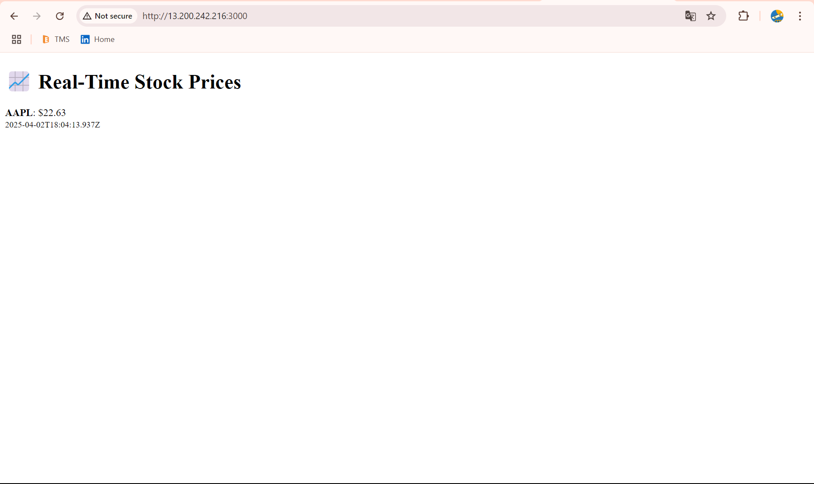

# 📈 Real-Time WebSocket Stock Price App (with Redis Pub/Sub + Docker Compose)


This project is a real-time WebSocket-based stock price broadcasting application built using **Node.js**, **WebSockets**, **Redis Pub/Sub**, and **Docker Compose**.

> 🔧 The app simulates stock prices and sends them to connected WebSocket clients via a Redis channel.

---

## 🧱 Project Structure

```bash
.
├── Dockerfile
├── docker-compose.yml
├── package.json
├── package-lock.json
├── server.js
├── publisher.js
└── public/
    └── index.html
```

## 📦 Requirements

- AWS EC2 Ubuntu Instance
- Docker & Docker Compose installed
- PuTTY (for Windows users)
- Node.js (installed inside Docker only)

---

## ⚙️ Installation Steps

### 1️⃣ Launch AWS EC2 Instance & Connect

- Launch an EC2 Ubuntu instance.
- Configure PuTTY and connect as `ubuntu`.

### 2️⃣ Install Docker & Docker Compose

```bash
sudo su
apt update && apt upgrade -y
apt install docker.io -y
service docker start
apt install docker-compose -y
```

---

## 📁 Create and Add Files

### ➕ Dockerfile
```bash
nano Dockerfile
```

```dockerfile
WORKDIR /app

COPY package.json package-lock.json ./
RUN npm install

COPY . .

EXPOSE 3000

CMD ["node", "server.js"]
```

### ➕ docker-compose.yml
```bash
nano docker-compose.yml
```

```yaml
services:
  redis:
    image: redis:latest
    container_name: redis
    restart: always
    ports:
      - "6379:6379"

  websocket-server:
    build: .
    container_name: websocket-server
    restart: always
    ports:
      - "3000:3000"
    depends_on:
      - redis

  publisher:
    build: .
    container_name: stock-publisher
    restart: always
    depends_on:
      - redis
    command: ["node", "publisher.js"]
```

### ➕ package-lock.json
```bash
nano package-lock.json
```

```json
{
  "name": "stock-websocket",
  "lockfileVersion": 3,
  "requires": true,
  "packages": {
    "": {
      "dependencies": {
        "dotenv": "^16.5.0",
        "express": "^4.5.0",
        "redis": "^4.7.0",
        "ws": "^8.18.1"
      }
    },
    "node_modules/@redis/bloom": {
      "version": "1.2.0",
      "resolved": "https://registry.npmjs.org/@redis/bloom/-/bloom-1.2.0.tgz",
      "integrity": "sha512-HG2DFjYKbnNxa0keLH9/3leGJz1mjh09f2RlGLQjZzStpkmZWwvDJAv03qcRY8p80m5+zdKXdYOSBL1p7Cg==",
      "peerDependencies": {
        "@redis/client": "^1.0.0"
      }
    },
    "node_modules/@redis/client": {
      "version": "1.6.0",
      "resolved": "https://registry.npmjs.org/@redis/client/-/client-1.6.0.tgz",
      "integrity": "sha512-AR0uffXY0O0EB4YgniAnv3vzVGXCEVYfdpu/CUKvk4p8fLPEy/JSzyrpQ+15WhXelyjRXLTfQ84s4mEXnPg==",
      "dependencies": {
        "cluster-key-slot": "1.1.2",
        "generic-pool": "3.9.0",
        "yallist": "4.0.0"
      },
      "engines": {
        "node": ">=14"
      }
    },
    "node_modules/@redis/graph": {
      "version": "1.1.1",
      "resolved": "https://registry.npmjs.org/@redis/graph/-/graph-1.1.1.tgz",
      "integrity": "sha512-FEMTFHC8ZoZci1kR611B4ZmiG5z5F3F6a6FZCycrfxdKh0FlGkiAqlexkWMBZci4DcRoyioSuLfw+cj1gWYEx0w==",
      "peerDependencies": {
        "@redis/client": "^1.0.0"
      }
    },
    "node_modules/@redis/json": {
      "version": "1.0.7",
      "resolved": "https://registry.npmjs.org/@redis/json/-/json-1.0.7.tgz",
      "integrity": "sha512-6UyXjFzW7BiTkNK4G/92B9PKc6XGy8BiwaqDYcHkd/DVGHYWkUdnQDyzm72V7Tp21WUMhsqz5oy65kPcQ=="
    }
  }
}
```

### ➕ package.json
```bash
nano package.json
```

```json
{
  "name": "websocket-app",
  "version": "1.0.0",
  "description": "Real-time WebSocket application with Redis Pub/Sub",
  "main": "server.js",
  "scripts": {
    "start": "node server.js",
    "publish": "node publisher.js"
  },
  "dependencies": {
    "express": "^4.18.2",
    "ws": "^8.13.0",
    "ioredis": "^5.3.1",
    "dotenv": "^16.3.1"
  }
}
```

### ➕ publisher.js
```bash
nano  publisher.js
```

```js
const Redis = require("ioredis");
const redis = new Redis({ host: "redis", port: 6379 });

function getRandomStockPrice() {
  return (Math.random() * 100).toFixed(2);
}

setInterval(() => {
  const stockUpdate = {
    symbol: "AAPL",
    price: getRandomStockPrice(),
    timestamp: new Date().toISOString(),
  };

  redis.publish("stock_prices", JSON.stringify(stockUpdate));
  console.log("Published:", stockUpdate);
}, 2000);
```

### ➕ server.js
```bash
nano  server.js
```

```js
const express = require("express");
const WebSocket = require("ws");
const Redis = require("ioredis");
const path = require("path");

const app = express();
const server = require("http").createServer(app);
const wss = new WebSocket.Server({ server });

const redisSub = new Redis({ host: "redis", port: 6379 });
const redisPub = new Redis({ host: "redis", port: 6379 });

app.use(express.static(path.join(__dirname, "public")));

app.get("/", (req, res) => {
  res.sendFile(path.join(__dirname, "public", "index.html"));
});

redisSub.subscribe("stock_prices", (err, count) => {
  if (err) console.error("Redis subscription failed", err);
  else console.log(`Subscribed to ${count} channel(s).`);
});

redisSub.on("message", (channel, message) => {
  if (channel === "stock_prices") {
    wss.clients.forEach((client) => {
      if (client.readyState === WebSocket.OPEN) {
        client.send(message);
      }
    });
  }
});

wss.on("connection", (ws) => {
  console.log("New WebSocket client connected");
  ws.on("message", (msg) => redisPub.publish("stock_prices", msg));
  ws.on("close", () => console.log("Client disconnected"));
});

const PORT = 3000;
const HOST = "0.0.0.0";
server.listen(PORT, HOST, () => {
  console.log(`🚀 Server running on http://${HOST}:${PORT}`);
});
```

## 🛠️ Install Express WS Redis Commands
```bash
npm install express ws redis dotenv
```

## 🛠️ Install wscast Commands
```bash
npm install -g wscat
```

### ➕ public/index.html
```bash
mkdir -p public
nano public/index.html
```

```html
<!DOCTYPE html>
<html lang="en">
<head>
  <meta charset="UTF-8" />
  <meta name="viewport" content="width=device-width, initial-scale=1.0"/>
  <title>Real-Time Stock Prices</title>
</head>
<body>
  <h1>📈 Real-Time Stock Prices</h1>
  <div id="output">Waiting for stock updates...</div>

  <script>
    const ws = new WebSocket("ws://" + window.location.hostname + ":3000");
    ws.onmessage = (event) => {
      const data = JSON.parse(event.data);
      document.getElementById("output").innerHTML =
        `<strong>${data.symbol}</strong>: $${data.price} <br> <small>${data.timestamp}</small>`;
    };
  </script>
</body>
</html>
```

---

## 🏃 Run the App

```bash
docker-compose up --build
```

---

## ✅ Output

Visit:  
`http://<your-ec2-public-ip>:3000`


---
